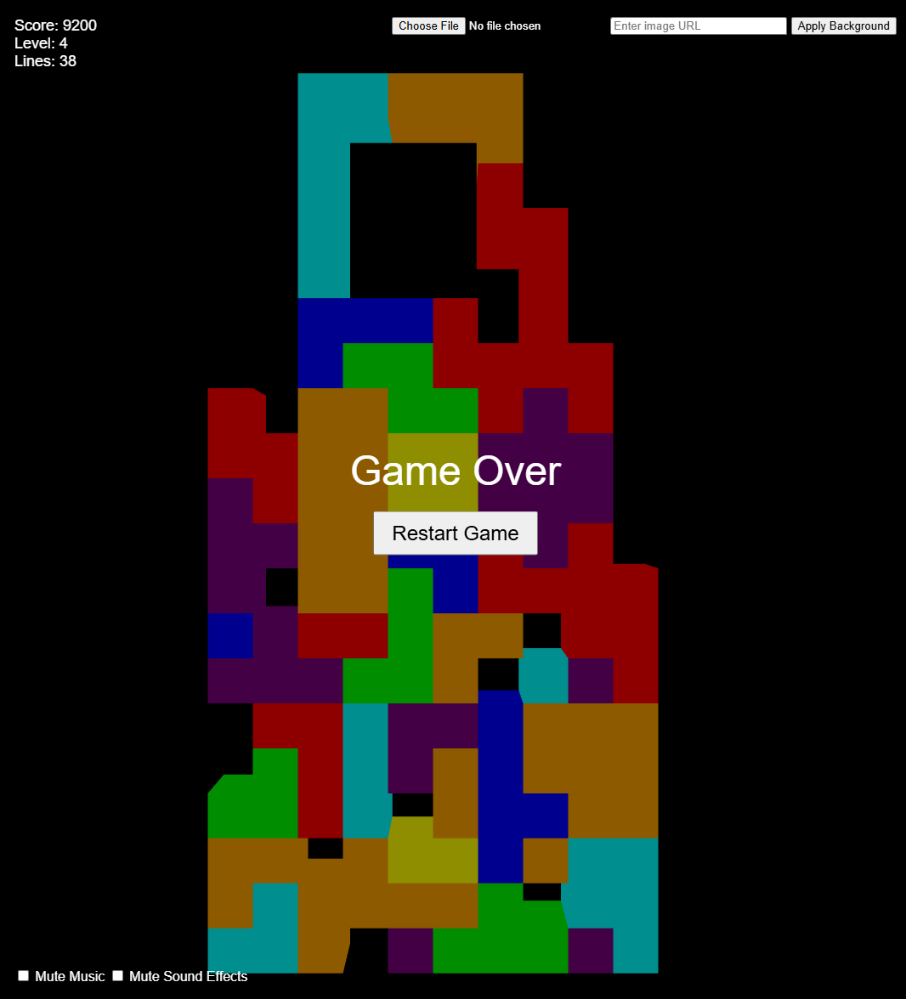

# Tetris Game

A modern implementation of the classic Tetris game using HTML5, JavaScript, and Three.js.

## Features

- 3D graphics rendered with Three.js
- Classic Tetris gameplay
- Score tracking and leveling system
- Background music and sound effects
- Customizable background
- Responsive design

## How to Run

1. Save the HTML file (e.g., `index.html`) to your local machine.
2. Open the file in a modern web browser (Chrome, Firefox, Safari, or Edge recommended).
3. Click the "Start Game" button to begin playing.

## Controls

- Left Arrow: Move piece left
- Right Arrow: Move piece right
- Down Arrow: Move piece down faster
- Up Arrow: Rotate piece
- Spacebar: Drop piece instantly

## Gameplay

- Arrange falling blocks to create complete horizontal lines.
- Completed lines will disappear and award points.
- The game speeds up as you clear more lines and advance in levels.
- The game ends when the blocks stack up to the top of the play area.

## Customization

- You can upload a custom background image or enter an image URL in the game.
- Toggle background music and sound effects using the checkboxes provided.

## Technical Details

- The game is built entirely in HTML and JavaScript.
- Three.js is used for 3D rendering.
- The Web Audio API is used for sound generation.

## Contributing

Feel free to fork this project and submit pull requests for any enhancements or bug fixes.

## License

This project is open source and available under the [MIT License](https://opensource.org/licenses/MIT).

